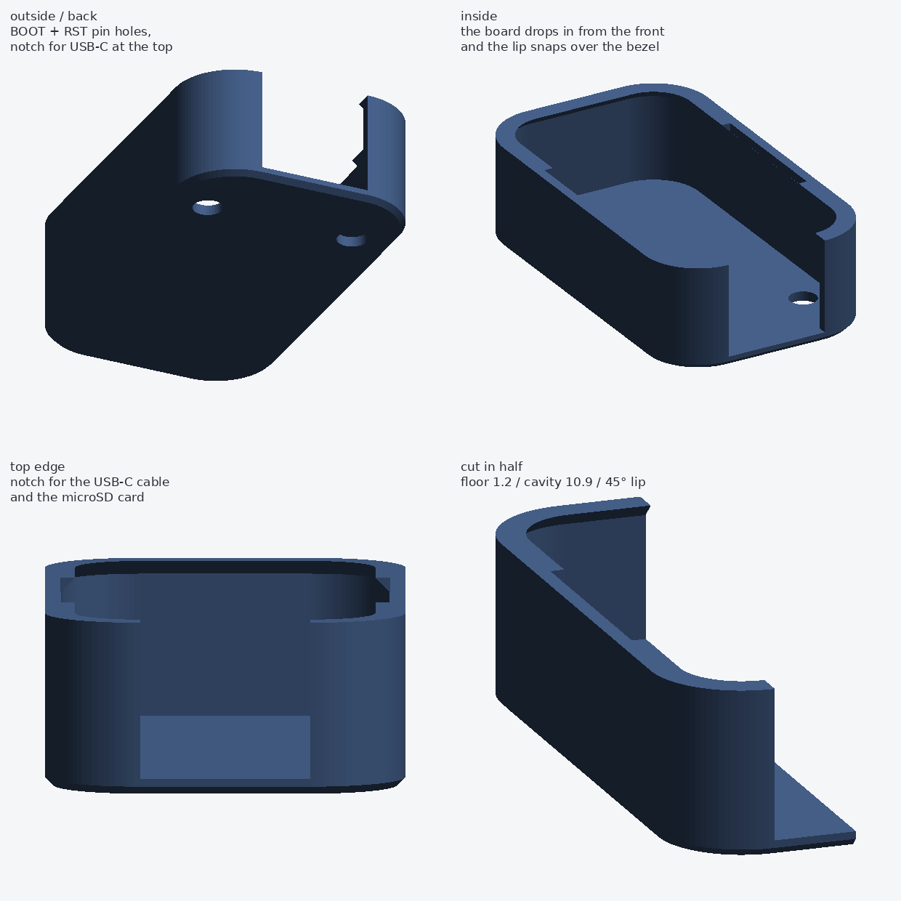

# מכסה אחורי ל-ESP32-S3-Touch-LCD-1.47

מכסה אחורי להדפסת תלת-מימד ללוח Waveshare ESP32-S3-Touch-LCD-1.47 / ESP32-S3-LCD-1.47
(מסך 1.47", 172×320), שמגיע עם מסגרת קדמית וגב פתוח.

העיצוב הוא **שרוול בסגנון כיסוי לטלפון**: הלוח נכנס מלפנים ומוחזק על ידי שפה דקה
שנתפסת על המסגרת הקדמית. לכן צריך לדעת רק את המידות החיצוניות של המסגרת הקדמית
(24.55 × 44.50 × 10.60, R5.75) — אלו המספרים מהשרטוט הרשמי של Waveshare — ולא שום דבר
על מה שקורה בתוך המסגרת. אין ברגים.



## מה מדפיסים

| קובץ | למה |
| --- | --- |
| `stl/back-cover-standard.stl` | הגרסה הרגילה. גב סגור. **תתחילו מזה.** |
| `stl/back-cover-headers.stl`  | אם הלחמתם פינים (headers) 2.54 מ"מ — שני חריצים ברצפה |
| `stl/back-cover-battery.stl`  | 5 מ"מ עומק נוסף לסוללת ליתיום קטנה מאחורי הלוח |

מידות חיצוניות: **27.55 × 47.50 × 13.20 מ"מ**, בערך 3.3 סמ"ק חומר (‏~4 גרם ב-PLA).

## הגדרות הדפסה

* **כיוון:** הרצפה למטה, הפתח כלפי מעלה. **בלי תמיכות** — השפה בנויה עם צ'מפר 45°.
* גובה שכבה 0.15–0.20 מ"מ, 3 קווי מעטפת, 20% מילוי.
* **חומר:** PETG או ABS/ASA עדיפים על PLA — המכסה יושב על ESP32 שמתחמם, ו-PLA
  מתחיל להתרכך סביב 55–60°C. PLA יעבוד לשימוש שולחני רגיל.
* הפלסטיק לא מפריע לאנטנת ה-2.4GHz.

**אם הלוח נכנס בכוח מדי או רפוי מדי** — משנים משתנה אחד, `CLEAR`, ומייצרים מחדש
(ראו למטה). ‏`CLEAR = 0.30` זה ברירת המחדל; `0.40` = רופף יותר, `0.20` = הדוק יותר.

## פתחים

* **קצה עליון** — חתך ברוחב 13 מ"מ, פתוח מהרצפה ועד למעלה: כבל USB-C וכרטיס microSD.
* **רצפה** — שני חורים Ø3.5 מ"מ מול BOOT ו-RST, גישה עם סיכה/עט.
* **צדדים** — השפה חתוכה לאורך 18 מ"מ באמצע כל צד ארוך. זה מה שמאפשר להכניס את
  הלוח ולהוציא אותו עם האגודל.
* השפה נכנסת 1.1 מ"מ פנימה מכל צד ועוצרת **2.0 מ"מ לפני** אזור המסך הפעיל, אז היא
  לא מכסה כלום מהתצוגה.

## מידות הלוח (מהשרטוט הרשמי)

| | מ"מ |
| --- | --- |
| מסגרת קדמית (רוחב × גובה × עובי) | 24.55 × 44.50 × 10.60 |
| רדיוס פינות | R5.75 |
| PCB (גובה) | 39.00, בולט 2.75 מכל קצה |
| חורי הברגה M2 | 17.78 × 25.40 |
| כפתורי BOOT / RST | 5.00 מקצה ה-PCB העליון |
| שטח תצוגה פעיל | 17.75 × 32.93, ממורכז |
| זכוכית | 22.05 × 42.00 |

## שינוי פרמטרים

כל המידות נמצאות בראש `generate_cover.py`. אחרי שינוי:

```sh
pip3 install numpy trimesh manifold3d scipy pillow
python3 generate_cover.py     # כותב מחדש את הקבצים ב-stl/
python3 preview.py            # מרנדר מחדש את preview.png
```

הפרמטרים השימושיים: `CLEAR` (מרווח התאמה), `WALL` / `FLOOR` (עובי), `LIP_W` / `LIP_H`
(כמה השפה תופסת), `TOP_NOTCH_W` (רוחב חתך ה-USB-C), `BUTTON_ACCESS`
(`"floor"` / `"side"` / `"none"`), `EXTRA_DEPTH` (מקום לסוללה).

## מה כדאי לוודא לפני הדפסה

השרטוט נותן את המידות החיצוניות במדויק, אבל שני דברים נלקחו ממנו בפירוש ולא במפורש —
כדאי לבדוק אותם על הלוח עצמו לפני שמדפיסים:

1. **כפתורי BOOT / RST** — האם הם על הגב (לוחצים מאחורה) או בצד? ברירת המחדל היא
   חורים ברצפה. אם הם בצד, משנים ל-`BUTTON_ACCESS = "side"`.
2. **חריץ ה-microSD** — היכן בדיוק הכרטיס נכנס. החתך העליון ברוחב 13 מ"מ אמור לכסות
   גם אותו וגם את ה-USB-C, בהנחה שהוא ממורכז.
